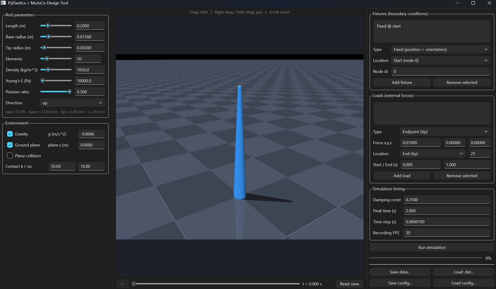

# PyElastica_Mujoco


A user-friendly GUI for setting up, running, and visualizing Cosserat rod
simulations built on [PyElastica](https://github.com/GazzolaLab/PyElastica),
with [MuJoCo](https://mujoco.org/) embedded as the interactive 3D renderer.

Define a tapered rod and its material, add boundary conditions and external
loads, configure the environment (gravity, ground plane, contact), then run the
simulation and animate the result, all in one window.

> 🚧 **Work in progress.** This project is under active development, features
> and APIs may change, and some functionality is still incomplete.

<!-- Add a screenshot of the GUI here, e.g.: -->


## Quick start

Install the dependencies (Python 3.10+ recommended):

```bash
pip install -r requirements.txt
```

Launch the GUI:

```bash
python elastica_gui.py
```

## Rod trajectory DAT files

The GUI loads and renders one or multiple rods from the shared versioned
`pyelastica-rod-trajectory` DAT format. Each system contains common frame times,
positions shaped `[frames, 3, nodes]`, a static element-radius profile, and
optional directors. Arrays are stored as portable dtype/shape/bytes records so
files work across different NumPy builds. Legacy single-rod PyElastica callback
DAT files remain supported. DAT is a pickle container and should only be opened
from trusted sources. See [the complete format contract](docs/DAT_FORMAT.md).
